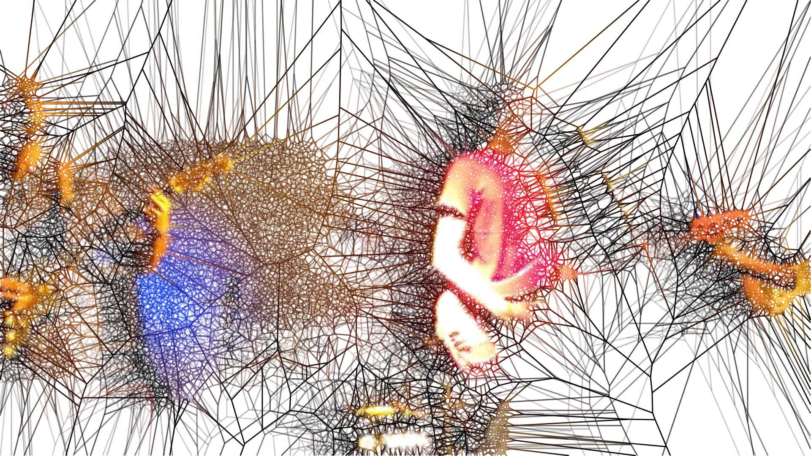
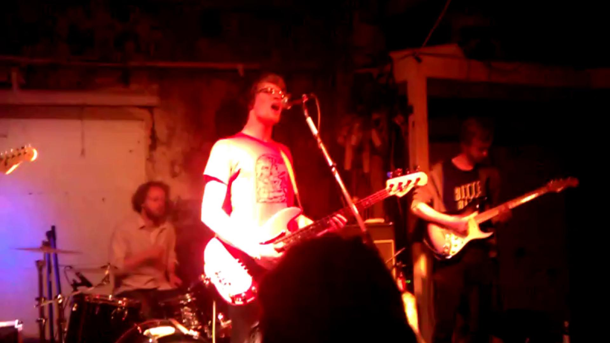
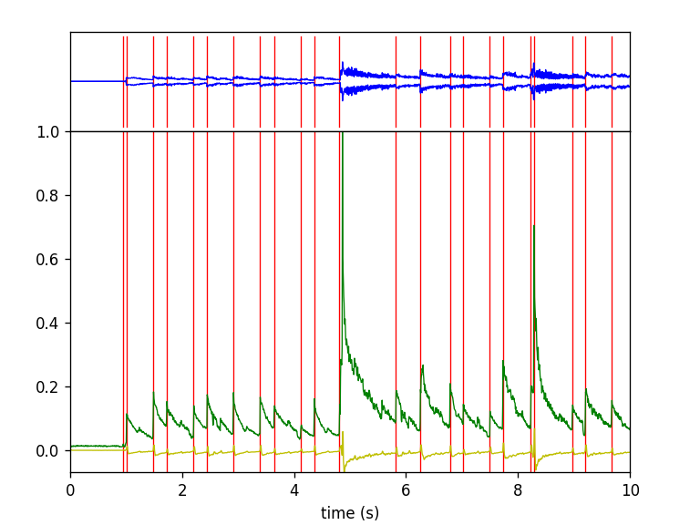
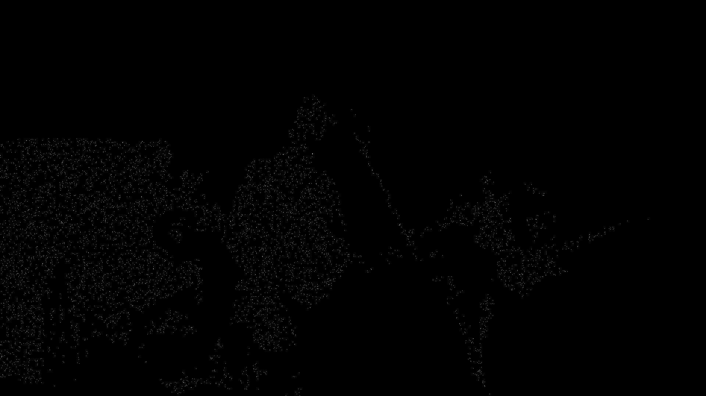
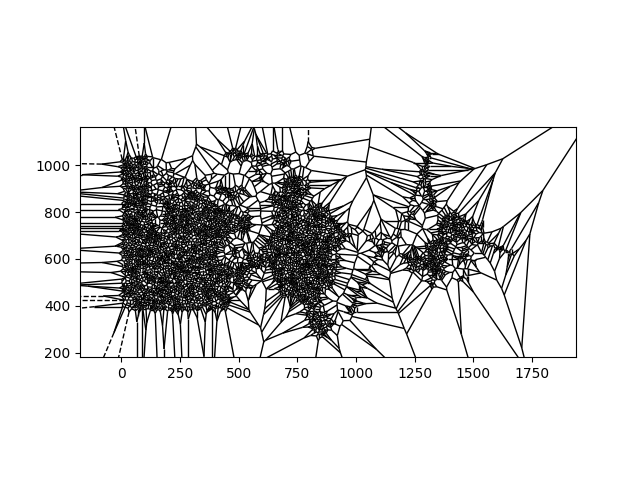
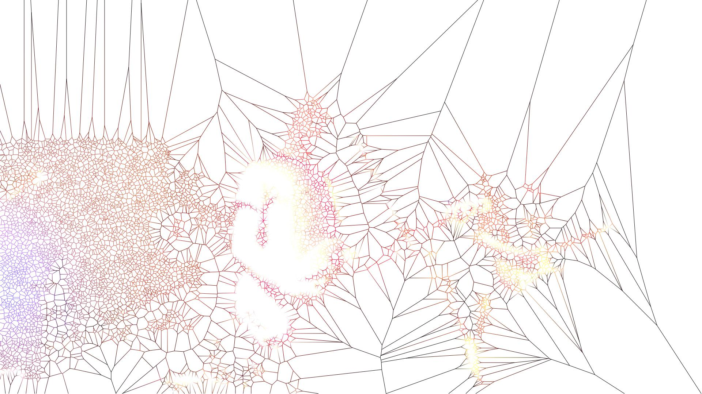

# *Voronoized* Music Video: kiriloff – Fortschritt

July 2018, Markus Konrad (post at mkonrad dot net)

A synthesized music video of the piece ["Fortschritt" from kiriloff](https://kiriloff.bandcamp.com/) programmed in Python. It uses [aubio](https://aubio.org/) for *[onset detection](https://en.wikipedia.org/wiki/Onset_(audio))* in the audio signal. Input video clips are alienated by drawing [Voronoi diagrams](https://en.wikipedia.org/wiki/Voronoi_diagram) derived from a sample of feature points from a [binarized frame](https://en.wikipedia.org/wiki/Binary_image) of the input clip. Video rendering is done with [MoviePy](https://zulko.github.io/moviepy/) and synthetic frame generation uses [Gizeh](https://github.com/Zulko/gizeh) and [cairocffi](https://cairocffi.readthedocs.io/en/stable/). See "Further explanation" section.

See the [final result at YouTube](https://www.youtube.com/watch?v=iBFQ0RlnyfU).

**Please note:** In case you want to clone this repository, you need to install the git extension for large files, *[git-lfs](https://git-lfs.github.com/).* This is because of the large video files included in the repository.

## Inspiration

* [Frankenstein Voronoi](https://fronkonstin.com/2017/03/07/frankenstein/)
* [Video Synthesizer with Python (aubio library)](https://www.makeartwithpython.com/blog/video-synthesizer-in-python/)

## Requirements

Python: 

See `requirements.txt`. Can be installed via *pip* with `pip install -r requirements.txt`.

System:

* [ffmpeg](https://ffmpeg.org/)

## Script files

There are three Python script files that can be run from command-line, and each has a specific purpose. Required script arguments are denoted as `<arg>` and optional arguments as `[arg]`:

* `onsets.py <audio input file> <onsets output pickle file> [plot output file] [number of seconds to read]`: Find onsets in audio and save them as pickle file.
* `video_preproc.py [lowres]`: Video preprocessing script (resizing, cropping, FPS adjustment). Takes raw videos from `video/raw` and preprocesses them according to the `SCENES` definition from `conf.py`. Optionally pass `lowres` to produce low resolution clips.
* `makevideo.py [clip duration]`: Main video rendering script. Takes the `SCENES` definition from `conf.py` and the preprocessed video files generated by `video_preproc.py` and renders the full video. Optionally pass `clip duration` to render only this duration of the video. 

## Scenes and video files

The video is rendered according to *scene definitions* that are given in `conf.py`. Each scene is defined by a beginning and end time, the input clip, as well as several rendering options. 

The input clips are taken from the `video` folder. The `video_preproc.py` script generates the files in this folder according to the scene definitions using the raw video files from `video/raw`. These files were not added to the git repository (there're too big). 

## Further explanation on synthetic frame rendering

The synthetic frames are generated using the following (very simplified) pipeline:

### 1. Inputs

We have an original input clip frame *C* at a certain time *t*:

Additionally, we have the onset amplitude *O* at *t*. The onset amplitude is the "strength" of a detected note at this time. For example, you can see in this image the detected onsets as red bars and the amplitude as green line. Both are combined by finding the maximum amplitude between to onsets to get the onset amplitude.

### 2. Binarization and feature generation

*C* is first blurred with a kernel size 5 in order to reduce noise and then binarized using [Otsu's method](https://en.wikipedia.org/wiki/Otsu's_method). Both is done using [OpenCV](https://opencv.org/). We get the following picture:

From the binarized image, we generate features *F* (the coordinates in frame image space where the binarized image is white), i.e. we get a list `[(x1, y1), (x2, y2), ... (xn, yn)]` where x and y are coordinates of the white pixels in the above image. For example in the above image, we get almost 500,000 features, i.e. there are almost 500,000 white pixels in the above image. 
 
### 3. Sampling

Sample from *F* according to *O* (i.e. the higher the onset amplitude the more features get sampled and the more Voronoi cells will be drawn) to get *S*. See the following picture where 6000 random points were sampled from the almost 500,000 features of the binarized image:

(Note that the sampled white pixels are hardly visible because they are very small as the resolution of the frame is quite high)

### 4. Create Voronoi regions

From feature samples *S* the Voronoi regions are calculated using [SciPy's Voronoi class](https://docs.scipy.org/doc/scipy/reference/generated/scipy.spatial.Voronoi.html#scipy.spatial.Voronoi). The raw SciPy plot looks like this:

### 5. Calculate Voronoi cell lines and draw them

The lines that make up the borders between the Voronoi regions are calculated to get to a Voronoi diagram restricted to frame image space. These lines are drawn according to scene definitions either with a solid color or with a color gradient using start and stop colors from the pixels of both end points of the line in the input clip. This for example draws the Voronoi cells on a white background and uses the color gradient effect:

Note that the actual rendering pipeline is little more complex as it also draws Voronoi diagrams of previous frames with decreasing transparency over time to get a smooth "changing spider webs" effect.
